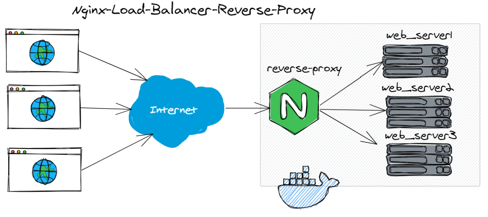

# Using Nginx as a Reverse Proxy - Load Balancer

Creating 3 httpd "Apache Web Server" containers as well as "Nginx" container. Nginx Container is built from Dockerfile which is custom image as it's configured to be a reverse-proxy load-balancer. Once you're installing `Docker` and `Docker-Compose`, you can clone the repo and run `docker-compose up` and start testing with going to `localhost:80` :) 
